# Plot recognition package
Allow recognizing plot data from image.

## Data flow of recognition process
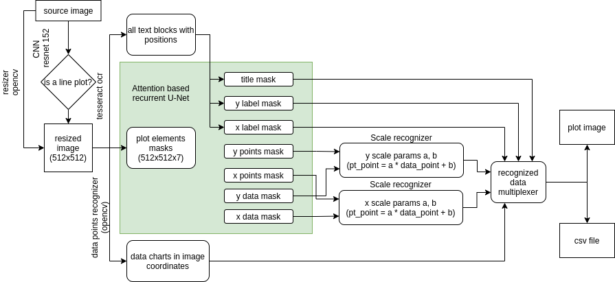

## Resnet 152
Deep learning neural network based on ResNet 152 architecture for plot types classification:
* bar graph -1 
* chart - 2 
* block diagram -3 
* chart - 4 (requred) 
* growth graph - 5 
* pie chart - 6 
* table - 7 
* just images - 0

Based on existing [solution](https://github.com/Grigorii-24/Graph-and-Chart-Recognition)

[Kaiming He, Xiangyu Zhang, Shaoqing Ren, Jian Sun. Deep Residual Learning for Image Recognition](https://www.cv-foundation.org/openaccess/content_cvpr_2016/papers/He_Deep_Residual_Learning_CVPR_2016_paper.pdf)

# Tesseract OCR
parse_text method in arearecognizer/recognition_plot.py
Use pytesseract module.
Generate 2 lists: recognized text blocks (list of words for each block) and block position (x, y, width, height for each position)

# Attention based recurrent U-Net deep learning network
Used to generate 7-channel mask for detecting positions of plot elements from RGB image with 512x512 size:
* 0 - Title
* 1 - x values
* 2 - y value
* 3 - x label
* 4 - y label
* 5 - x points
* 6 - y points

**Example**

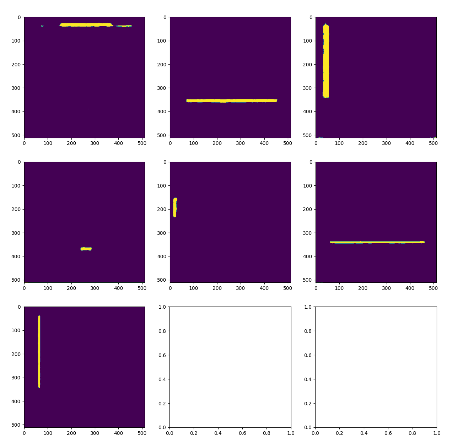

**Attention based recurrent U-Net deep learning network architecture**

Based on this solution: [Keras model](https://github.com/lixiaolei1982/Keras-Implementation-of-U-Net-R2U-Net-Attention-U-Net-Attention-R2U-Net.-)

**Attention block**
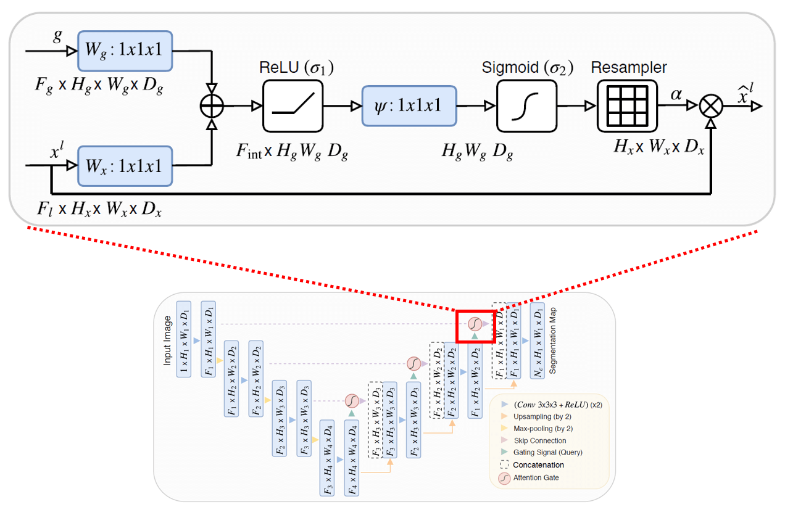

## Dataset generation and labeling

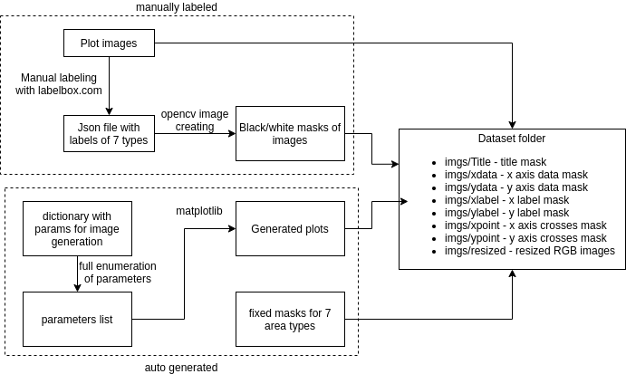

## Scale recognizer
**Data flow**
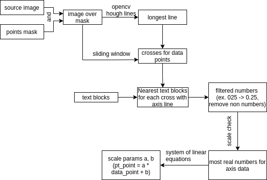

**Example**

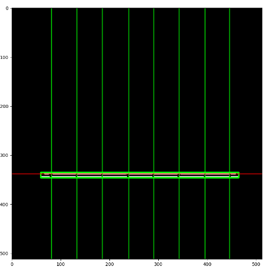
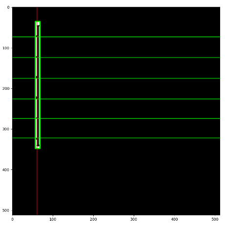

**Activity Diagram**

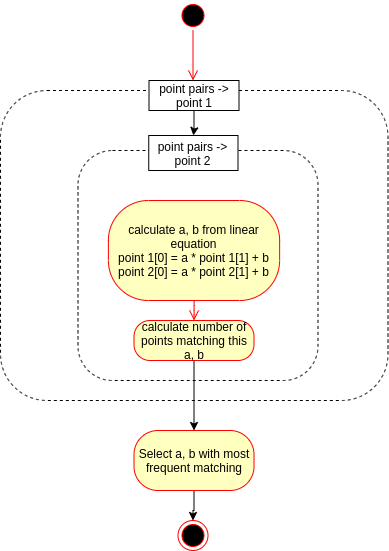

## Extract chart data with image coordinates

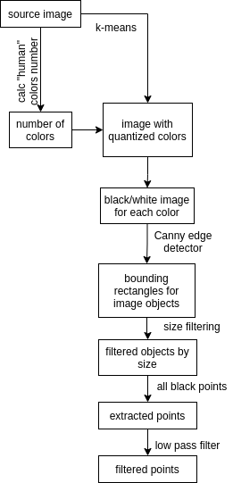

Low pass filter: 
$$O_n=O_{n-1} + \alpha(I_n  - O_{n-1})$$, 
where $O_n$ - new value, $O_{n-1}$ - previous value, $\alpha$ - regularization coefficient

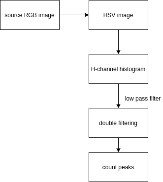

**Example**

Source image

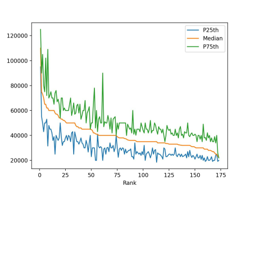

Color peaks

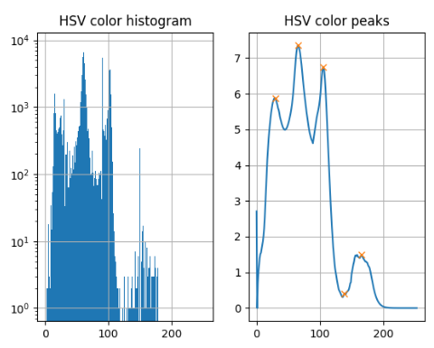

Recognized data

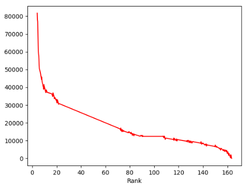
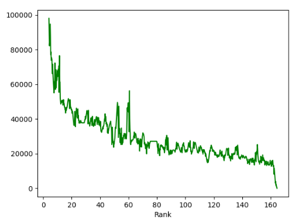
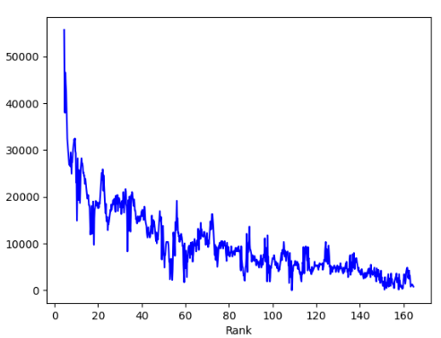
